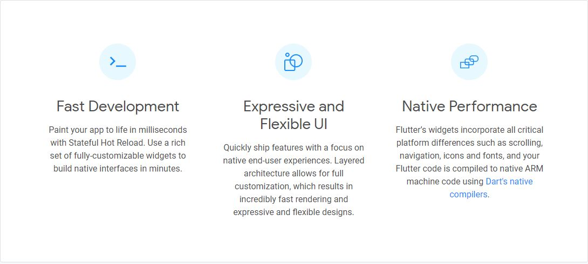
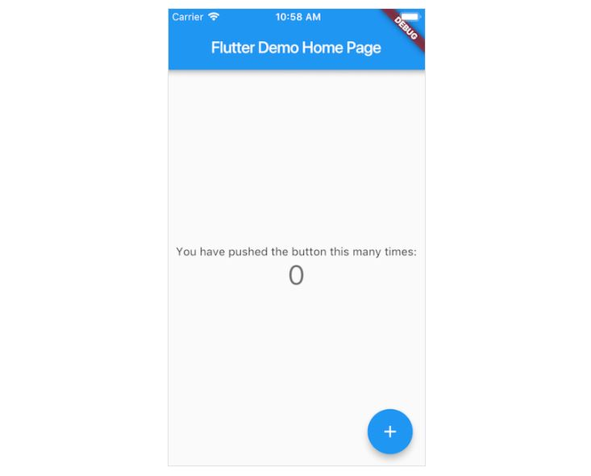

### What is Flutter?  
Flutter is Google’s UI toolkit for building beautiful, natively compiled applications for mobile, web, and desktop from a single codebase.  
The first version of Flutter was known as codename "Sky" and ran on the Android operating system. It was unveiled at the 2015 Dart developer summit, with the stated intent of being able to render consistently at 120 frames per second.  
The language supported by Flutter is known as __Dart__.  

### Why Flutter?  

  

### Install Flutter:  

1. Click the link to download Flutter SDK for Windows  
   https://storage.googleapis.com/flutter_infra/releases/stable/windows/flutter_windows_1.17.5-stable.zip   
2. Update your path in the Environment Variables    
- From the Start search bar, enter ‘env’ and select Edit environment variables for your account.
- Under User variables check if there is an entry called Path:
  - If the entry exists, append the full path to flutter\bin using ; as a separator from existing values.
  - If the entry doesn’t exist, create a new user variable named Path with the full path to flutter\bin as its value.  
3. Run __flutter version__ command to check flutter is installed and path is set. If it shows you the version then flutter is installed properly.  
4. Run __flutter doctor__ command which checks your environment and displays a report of the status of your Flutter installation.  
5. Flutter relies on a full installation of Android Studio to supply its Android platform dependencies so you need to install and setup Android Studio.  

### Install Android Studio:  

1. Download and install Android Studio.
   https://redirector.gvt1.com/edgedl/android/studio/install/4.0.1.0/android-studio-ide-193.6626763-windows.exe
2. Start Android Studio, and go through the ‘Android Studio Setup Wizard’. This installs the latest Android SDK, Android SDK Command-line Tools, and Android SDK Build-Tools, which are required by Flutter when developing for Android.  

### Set up your Android device:  
To prepare to run and test your Flutter app on an Android device, you need an Android device running Android 4.1 (API level 16) or higher.  

1. Enable Developer options and USB debugging on your device. Detailed instructions are available in the Android documentation.  
   https://developer.android.com/studio/debug/dev-options
2. Windows-only: Install the Google USB Driver.  
   https://developer.android.com/studio/run/win-usb
3. Using a USB cable, plug your phone into your computer. If prompted on your device, authorize your computer to access your device.  
4. In the terminal, run the __flutter devices__ command to verify that Flutter recognizes your connected Android device. By default, Flutter uses the version of the Android SDK where your adb tool is based. If you want Flutter to use a different installation of the Android SDK, you must set the __ANDROID_SDK_ROOT__ environment variable to that installation directory.  

### Set up the Android emulator:  
To prepare to run and test your Flutter app on the Android emulator, follow these steps:

1. Enable VM acceleration on your machine.
   https://developer.android.com/studio/run/emulator-acceleration
2. Launch __Android Studio > Tools > Android > AVD Manager__ and select __Create Virtual Device__. (The __Android submenu__ is only present when inside an Android project.)  
3. Choose a device definition and select __Next__.  
4. Select one or more system images for the Android versions you want to emulate, and select __Next__. An x86 or x86_64 image is recommended.  
5. Under Emulated Performance, select __Hardware - GLES 2.0__ to enable hardware acceleration.  
   https://developer.android.com/studio/run/emulator-acceleration
6. Verify the AVD configuration is correct, and select __Finish__.  
   For details on the above steps, see Managing AVDs.  
   https://developer.android.com/studio/run/managing-avds
7. In Android Virtual Device Manager, click __Run__ in the toolbar. The emulator starts up and displays the default canvas for your selected OS version and device.  

### Set up an editor:  
You can build apps with Flutter using any text editor combined with our command-line tools. However, we recommend using one of our editor plugins for an even better experience. These plugins provide you with code completion, syntax highlighting, widget editing assists, run & debug support, and more.  

#### Install VS Code-  
VS Code is a lightweight editor with Flutter app execution and debug support.
- VS Code, latest stable version  
  https://aka.ms/win32-x64-user-stable  

#### Install the Flutter and Dart plugins-  
1. Start VS Code.  
2. __Invoke View > Command Palette…__.
3. Type “install”, and select __Extensions: Install Extensions__.  
4. Type “flutter” in the extensions search field, select __Flutter__ in the list, and click __Install__. This also installs the required Dart plugin.  

#### Validate your setup with the Flutter Doctor-  

1. Invoke __View > Command Palette…__.  
2. Type “doctor”, and select the __Flutter: Run Flutter Doctor__.  
3. Review the output in the __OUTPUT__ pane for any issues. Make sure to select Flutter from the dropdown in the different Output Options.  

### Creating Test App:  
Go to your Windows command prompt and run following commands.  

1. Create the test_app    
```flutter create test_app```  
2. Check the list of emulators    
```flutter emulators```  
3. Launch the emulator  
```flutter emulators --launch <Device name>```    
4. Goto test_app project and you can see multiple folders inside this but main folder for us is __lib__ inside where we develop our code for our app  
5. Run the app where your test_app project is created  
```flutter run```  

  


